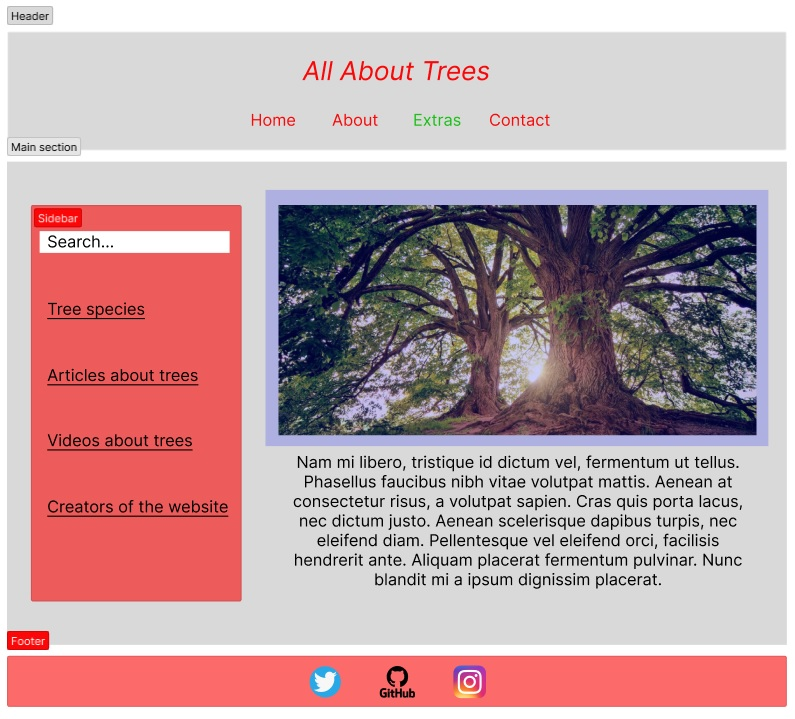

# All About Trees

This is a small webpage dedicated to providing information about trees. The site
features articles, images, and resources related to various types of trees and
their importance to the environment.

---

## Wireframe

Color legend:

- Red - **must-haves**
- Green - **should-haves**
- Blue - **could-haves**

## Setup

- Created a repository
- Cloned the repository
- Created a project board
- HTML file
- CSS file linked to the HTML

## Title

<!-- each issue created from this section will have the `for: user story` label -->

> "As a first time visitor of the website I should understand what the website
> is about."

- [ ] _there is a title the top of the page_

### Title: HTML

- Create `<h1>` tag with the name of the website "All about trees"

### Title: CSS

- Center the title
- color: red
- font-style: italic

## Nav-bar

> "As a first time visitor of the website I should be able to access different
> parts of the website by clicking on the buttons in the navigation bar."

- [ ] _there is a navigation bar at the top of the page_

### Nav-bar: HTML

- Create `<nav>` tag with several `
` tags inside
- Each `
` contains the name of the link: Home, About, etc.

### Nav-bar: CSS

- Center the `<nav>`
- color: red
- add margin to `
`

## Main section

> "As a visitor of the website I should see images or animations of trees."

- [ ] _there are images or animations of trees/tree parts_

### Main section: HTML

- Create `
` with image and article
- Create `<image>` and add to it alt attribute and src
- Create `<article>` or several `
` elements with random text

### Main section: CSS

- Give the width and height of the image in pixels

## Sidebar

> "As a user of the website, I should be able to search for what I need on the
> website and have access to various resources."

- [ ] _there is a sidebar in the main section with a search bar and links for
      resources_

### Sidebar: HTML

- Create `
` inside the `<main>` tag
- Inside `
` create an `<input>` field
- Inside `
` create `<ul>` with several `<li>` inside

### Sidebar: CSS

- Get rid of bullet points in the `<li>`
- Underline the `<li>`

## Footer

> "As a nature enthusiast I should be able to contact the creators of the
> website to talk to them about the environment by clicking on the links for
> different platforms.

- [ ] _there are links for different platforms at the footer of the page for
      contacting the authors of the website_

### Footer: HTML

- Create `<nav>` with social media icons/images

### Footer: CSS

- Center the `<nav>`
- Add some margin to icons
